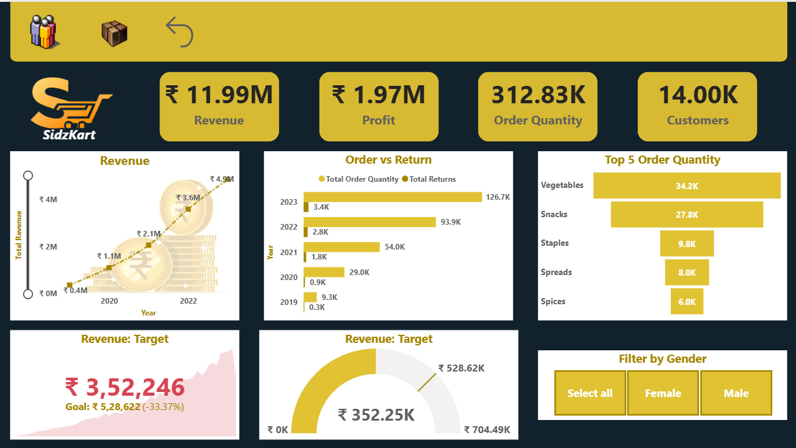
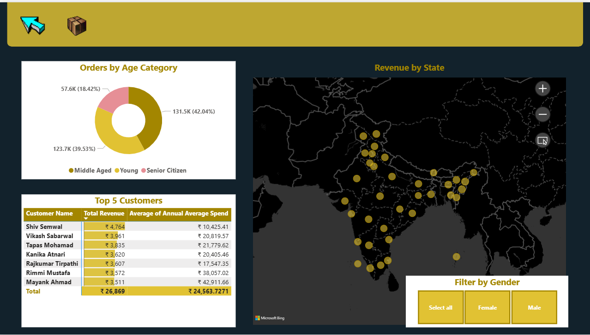
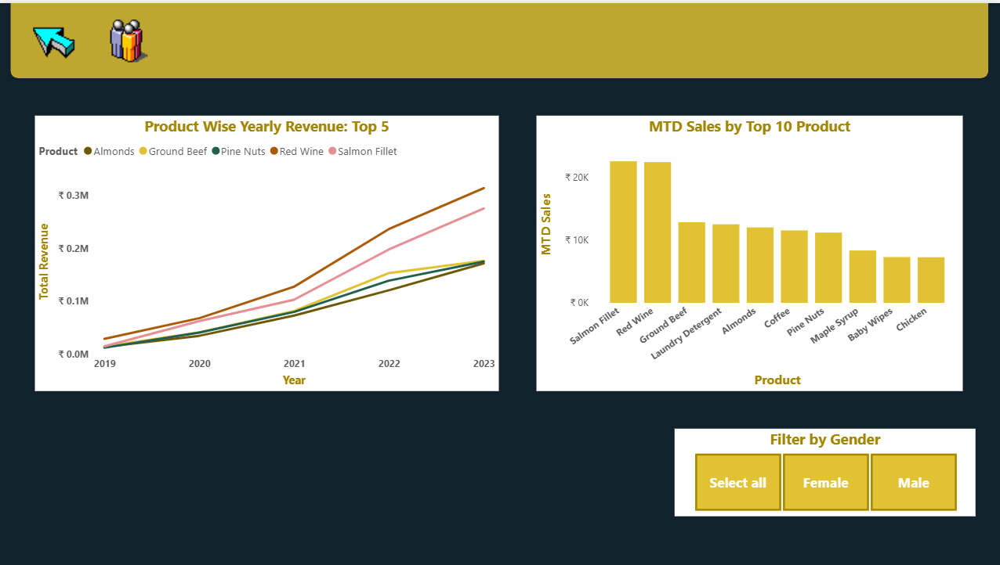

## Sidzkart Sales Dashboard

### Business Objective
The objective of this project is to analyze retail sales performance and provide actionable business insights using an interactive Power BI dashboard.
This dashboard helps stakeholders:
- Monitor revenue, profit, and order performance
- Analyze customer purchasing behavior
- Identify top-performing products and categories
- Track sales trends over time
- Compare orders and returns
- Evaluate regional sales performance
- Support data-driven business decisions

### Dataset
Source- Kaggle
Tables- Customer, Products, Returns, Sales Transactions, Calendar(DAX Table)

### Data Model
The dashboard follows a star schema model where the Orders table acts as the central fact table connected to multiple dimension tables.
Customers ↔ Sales Transactions→ connected using `Customer ID`
Returns↔ Sales Transactions→ connected using `Transaction ID`
Products↔ Sales Transactions→ connected using `Product ID`
Calendar↔ Sales Transactions→ connected using `Date`
Model Design:
- One-to-many relationships
- Single-direction filtering
- Optimized for reporting performance

### Dashboard Pages
**Page 1 —  Sales Overview**

This page provides a high-level overview of the retail business’s overall sales performance. The KPI cards at the top display key business metrics including Total Revenue (₹11.99M), Total Profit (₹1.97M), Order Quantity (312.83K), and Total Customers (14K), enabling quick monitoring of overall business health and profitability.

The Revenue Trend line chart analyzes yearly revenue growth from 2019 to 2023. Revenue shows a consistent upward trend, increasing from approximately ₹0.4M in 2019 to ₹4.9M in 2023, indicating strong business growth and increasing customer demand over time.

The Orders vs Returns bar chart compares total order quantity with product returns across multiple years. While order quantity has increased significantly year-over-year, returns have also risen gradually but returns are very few as compared to orders.

The Top 5 Order Quantity funnel chart highlights the highest-selling product categories based on order volume. Vegetables generate the highest order quantity, followed by Snacks and Staples, indicating strong customer demand for essential grocery products.

The Revenue Target KPI visual compares actual revenue against the business target. The dashboard shows the business is currently below the target goal, helping stakeholders monitor target achievement and overall performance gaps.

The interactive Gender Filter allows users to dynamically analyze sales performance and customer behavior based on gender segmentation.

**Page 2 — Customer & Regional Analysis**

This page focuses on customer demographics, purchasing behavior, and geographic sales distribution to better understand customer segments and regional business performance.

The Orders by Age Category donut chart analyzes customer contribution by age group. Middle-aged customers contribute the highest share of total orders, followed closely by young customers, while senior citizens account for a smaller percentage of overall purchases. This insight helps businesses identify their most valuable customer segments.

The Revenue by State map visual displays sales distribution across different states in India. The map helps identify high-performing regions and areas with lower sales contribution, supporting region-based marketing and expansion strategies.

The Top Customers table highlights the highest revenue-generating customers along with their average annual spending. This helps identify loyal and high-value customers who contribute significantly to overall business revenue.

The interactive Gender Filter enables dynamic comparison of customer purchasing behavior and sales performance across male and female customer groups.

**Page 3 — Product Performance Analysis**

This page provides detailed insights into product-level sales performance and revenue contribution across different time periods.

The Product-wise Yearly Revenue Trend line chart compares revenue growth of top-performing products from 2019 to 2023. Products such as Red Wine and Salmon Fillet demonstrate the highest revenue growth over time, while products like Almonds and Pine Nuts show moderate but consistent performance.

The MTD (Month-to-Date) Sales by Top 10 Products bar chart highlights the best-selling products for the current month. Salmon Fillet and Red Wine generate the highest monthly sales, indicating strong short-term customer demand for these products.

The dashboard helps stakeholders identify:

* Best-performing products
* Revenue growth trends
* High-demand products
* Product sales opportunities
* Inventory and promotion priorities

The interactive Gender Filter allows users to analyze product sales trends and purchasing preferences based on customer gender.

### DAX Measures
- **Total Revenue** — Calculates total revenue

- **Total Profit** — Calculates total profit 

- **MTD Sales** — It calculates the sale of the from  the first day of the current month till present day

- **Last Month Revenue** — It calculates the revenue of the previous month

 ### Tools Used 
Power BI Desktop — Data Cleaning(Power Query),DAX measures, Star Schema data model, Time Intelligence functions, Cross-page slicers, Map visual, KPI gauge, MTD/Target calculations
